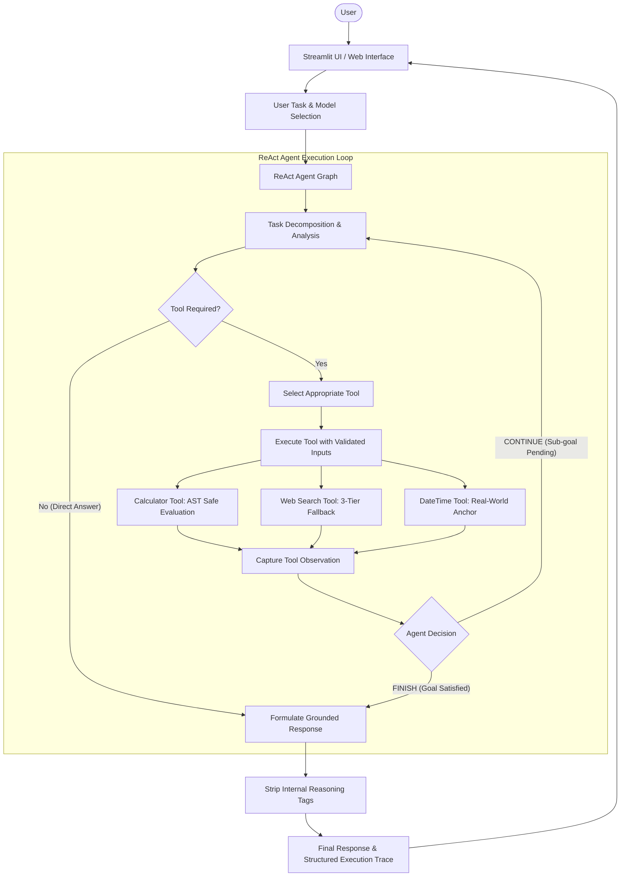

# Intelligent Task Execution Agent

An autonomous reasoning and multi-step execution agent built with LangChain, LangGraph, the ReAct pattern, and Streamlit, powered locally by Ollama.

---

## 1. Problem Statement

Standard Large Language Models (LLMs) suffer from inherent cognitive and operational limitations when tasked with real-world problem solving:

1. **Mathematical Hallucination**: LLMs lack native numerical computation capabilities, frequently generating erroneous calculations for arithmetic, formulas, and multi-step math problems.
2. **Static Knowledge Cutoff**: Models cannot access real-time web facts, current documentation, or recent developments without external information retrieval.
3. **Temporal Blindspots**: LLMs possess no internal clock and cannot determine the current date, time, weekday, or timezone, leading to hallucinations on time-dependent queries.
4. **Single-Pass Execution Bottlenecks**: Standard LLM pipelines execute single-pass text generation without an autonomous feedback loop to inspect intermediate tool results, evaluate whether sub-goals are satisfied, and decide dynamically whether to continue execution or conclude with a final answer.

This project addresses these fundamental limitations by building an **autonomous ReAct agent** with deterministic tool execution, multi-tier fallback resilience, and explicit loop termination control.

---

## 2. Project Objective

The **Intelligent Task Execution Agent** provides an end-to-end autonomous agentic solution designed to:

* Accept high-level, unstructured natural language goals from users.
* Analyze and decompose complex goals into discrete operational steps.
* Dynamically select and execute specialized tools (safe mathematics, multi-tier web search, and temporal anchor).
* Observe intermediate results, ground reasoning in factual outputs, and determine whether to **CONTINUE** to another tool or **FINISH**.
* Present execution traces, tool arguments, observations, decision flow, and final answers through a modern, interactive Streamlit web dashboard.

---

## 3. Main Features

* **Autonomous ReAct Reasoning Loop**: Implements the Thought → Action → Observation → Decision cycle with explicit step-by-step state tracking.
* **Deterministic Safe Mathematics (`calculate`)**: Evaluates math expressions using Python's Abstract Syntax Tree (AST), rejecting arbitrary code injection while supporting arithmetic, powers, roots, and trigonometry.
* **Resilient Multi-Tier Web Search (`web_search`)**: Robust web information retrieval featuring a 3-tier automatic fallback architecture (DuckDuckGo Search Library → DuckDuckGo Instant Answer API → Wikipedia Search API).
* **Real-Time Temporal Anchor (`get_current_datetime`)**: Resolves current dates, times, days of the week, and ISO timestamps.
* **Dynamic Continue vs. Finish Decision Logic**: Autonomously determines when a goal requires further tools (e.g., temporal lookup followed by arithmetic) versus immediate conclusion.
* **Clean Response Grounding**: Automatically strips internal `<think>` tags and ensures responses are strictly grounded in tool observations.
* **Dual Local Model Support**: Switch seamlessly between `llama3.2:3b` (ultra-fast multi-threaded CPU inference) and `qwen3:4b` (deep multi-step reasoning).
* **Interactive Streamlit Web Dashboard**: Features glassmorphism UI, real-time `st.status` streaming, executive metrics tiles, collapsible step trace cards, and error handling.
* **Automated Health Check & Test Suite**: 21-point environment diagnostic script (`health_check.py`) and a 37-test automated test suite covering all modules.

---

## 4. Agent & Architecture Overview

The system architecture follows the **ReAct (Reasoning + Acting)** framework orchestrated via **LangGraph**:



### Component Breakdown

* **`agent/agent.py`**: Core execution engine wrapping LangGraph's ReAct agent, managing streaming updates, capturing tool calls, and formatting decision sequences.
* **`agent/prompts.py`**: System prompt providing operational constraints, available tools, observation evaluation rules, and output style guidelines.
* **`agent/llm.py`**: LLM connection factory configuring ChatOllama with multi-threaded CPU optimization (`num_thread`, `num_ctx=2048`).
* **`tools/registry.py`**: Central tool catalog providing discovery, registration, and mapping for LangChain tool binding.
* **`tools/calculator.py`**: Safe AST-based mathematical evaluator preventing arbitrary code execution.
* **`tools/datetime_tool.py`**: Temporal anchor utility providing localized and UTC date/time representations.
* **`tools/web_search.py`**: 3-tier resilient search integration with automatic fallbacks.
* **`app.py`**: Streamlit application entry point featuring the real-time execution dashboard.
* **`config/__init__.py`**: Centralized configuration loader for environment variables and defaults.
* **`health_check.py`**: Diagnostic script validating Python, dependencies, project structure, and Ollama status.

---

## 5. Technologies Used

| Technology | Purpose |
| :--- | :--- |
| **Python 3.11+** | Primary runtime environment |
| **LangChain Core & Ollama** | LLM interfacing, message types, and tool binding |
| **LangGraph** | ReAct state graph orchestration and event streaming |
| **Ollama** | Privacy-preserving local LLM inference (`llama3.2:3b`, `qwen3:4b`) |
| **Streamlit** | Modern, responsive web user interface and test harness |
| **Python AST Module** | Safe mathematical evaluation without arbitrary code execution risks |
| **DuckDuckGo & Wikipedia APIs** | Real-time external knowledge retrieval without paid API keys |
| **python-dotenv & Pydantic** | Configuration management and schema validation |
| **unittest & AppTest** | Automated testing across unit, integration, and UI layers |

---

## 6. Project Structure

```
intelligent-task-agent/
│
├── app.py                      # Streamlit web application & execution dashboard
├── health_check.py             # System diagnostics (Python, packages, Ollama, paths)
├── requirements.txt            # Runtime dependencies with pinned versions
├── README.md                   # Comprehensive project documentation
├── .gitignore                  # Git ignore rules for caches, secrets, and virtualenvs
├── .env.example                # Environment variables template
│
├── agent/                      # Agentic orchestration & reasoning modules
│   ├── __init__.py             # Agent package exports
│   ├── agent.py                # ReAct execution loop, event streaming, & decision tracking
│   ├── llm.py                  # ChatOllama initialization & CPU acceleration configuration
│   └── prompts.py              # System prompt & operational instructions
│
├── tools/                      # Tool registry & tool implementations
│   ├── __init__.py             # Tools package exports
│   ├── registry.py             # Centralized tool catalog & discovery
│   ├── calculator.py           # Safe AST-based mathematical evaluation tool
│   ├── datetime_tool.py        # Real-time temporal anchor tool
│   └── web_search.py           # Resilient 3-tier web search tool
│
├── config/                     # Configuration management
│   └── __init__.py             # Centralized settings & environment variable bindings
│
├── ui/                         # UI package
│   └── __init__.py             # UI module definition
│
└── tests/                      # Automated test suite (37 tests)
    ├── __init__.py             # Tests package exports
    ├── test_tools.py           # Unit tests for calculator, search, datetime, & registry (21 tests)
    ├── test_llm.py             # Integration tests for ChatOllama & model invocation (2 tests)
    ├── test_agent.py           # ReAct tool calling, observation, & response cleanliness (6 tests)
    ├── test_decisions.py       # Multi-step execution & CONTINUE/FINISH decision flow (4 tests)
    └── test_ui.py              # Automated Streamlit UI tests using AppTest (4 tests)
```

---

## 7. Installation & Setup Instructions

### Prerequisites

1. **Python 3.11+** installed on your system.
2. **Ollama** installed and running locally ([https://ollama.com](https://ollama.com)).

### Step 1: Clone the Repository

```bash
git clone <repository-url>
cd intelligent-task-agent
```

### Step 2: Set Up Virtual Environment

**Windows (PowerShell):**
```powershell
python -m venv .venv
.venv\Scripts\Activate.ps1
```

**Linux / macOS:**
```bash
python3 -m venv .venv
source .venv/bin/activate
```

### Step 3: Install Dependencies

```bash
pip install -r requirements.txt
```

### Step 4: Pull Required Local Models in Ollama

Ensure the Ollama service is active (`ollama serve`), then pull the required models:

```bash
# Pull the fast default model (recommended for responsive CPU inference)
ollama pull llama3.2:3b

# Pull the deep reasoning model (for complex multi-step reasoning)
ollama pull qwen3:4b
```

### Step 5: Configure Environment Variables

Copy the provided `.env.example` to create your local `.env` file:

```bash
cp .env.example .env
```

### Step 6: Run Health Check Diagnostics

Validate your setup, dependencies, and Ollama connection before launching:

```bash
python health_check.py
```

Expected output:
```
======================================================================
  INTELLIGENT TASK EXECUTION AGENT - HEALTH CHECK (PHASE 0)
======================================================================
...
  SUMMARY: 21 PASSED | 0 WARNINGS | 0 FAILED
======================================================================
  OVERALL STATUS: HEALTHY (PASS)
```

---

## 8. Environment Variables & API Key Setup

Configuration is managed via `config/__init__.py` using `python-dotenv`.

| Variable Name | Default Value | Description |
| :--- | :--- | :--- |
| `OLLAMA_BASE_URL` | `http://127.0.0.1:11434` | Ollama service REST API endpoint |
| `MODEL_NAME` | `qwen3:4b` | Default backend LLM model identifier |
| `TEMPERATURE` | `0.0` | Sampling temperature (`0.0` for deterministic reasoning) |
| `REQUEST_TIMEOUT` | `60` | Client request timeout in seconds |
| `APP_NAME` | `Intelligent Task Execution Agent` | Application display name |
| `APP_ENV` | `development` | Deployment environment (`development` / `production`) |
| `STREAMLIT_SERVER_PORT` | `8501` | Streamlit web server port |
| `STREAMLIT_SERVER_ADDRESS`| `localhost` | Streamlit binding address |

> **Security Note on API Keys:**  
> This application runs **100% locally and keylessly**. By leveraging Ollama for local inference and DuckDuckGo/Wikipedia for web retrieval, **no paid API keys, tokens, or external credentials are required**.  
> The `.env.example` file contains optional commented placeholders (`OPENAI_API_KEY`, etc.) should you choose to extend the architecture to cloud providers, but no secrets are ever committed.

---

## 9. How to Run the Application

Launch the Streamlit web dashboard:

```bash
streamlit run app.py
```

Once started, open your web browser to:
```
http://localhost:8501
```

### Interacting with the Interface

1. **Select Model**: Use the sidebar dropdown to toggle between `llama3.2:3b` (optimized for CPU speed) and `qwen3:4b` (optimized for multi-step reasoning).
2. **Enter Task**: Type your question or objective into the task input box (or pick an example from the expandable suggestions).
3. **Execute**: Click **Run Agent**.
4. **Inspect Trace**: Observe the real-time execution progress, executive metric bar, tool arguments, observations, and the final response.

---

## 10. Usage Examples

### Example 1: Direct Reasoning (No Tool Required)
* **Input**: `"Explain what an algorithm is in simple terms."`
* **Agent Flow**: Task Analysis → Direct Answer (No tool needed) → Decision: `FINISH`
* **Output**: Clear conceptual explanation delivered directly without external tool invocation.

### Example 2: Mathematical Computation (`calculate`)
* **Input**: `"What is 125 * 8?"`
* **Agent Flow**: Task Analysis → Tool Selected: `calculate` (`expression: "125 * 8"`) → Observation: `1000` → Decision: `FINISH`
* **Output**: `"125 multiplied by 8 is 1,000."`

### Example 3: Temporal Anchor (`get_current_datetime`)
* **Input**: `"What is the current date and time?"`
* **Agent Flow**: Task Analysis → Tool Selected: `get_current_datetime` → Observation: `Current Date: Tuesday, September 08, 2026 ...` → Decision: `FINISH`
* **Output**: Exact, grounded current date, time, and timezone.

### Example 4: Real-Time Web Search (`web_search`)
* **Input**: `"Search the web for what the Python programming language is."`
* **Agent Flow**: Task Analysis → Tool Selected: `web_search` (`query: "Python programming language"`) → Observation: `Search Results: [1] Python Overview ...` → Decision: `FINISH`
* **Output**: Factual summary synthesized from retrieved web snippets with citations.

### Example 5: Multi-Step Goal (`CONTINUE` → `FINISH`)
* **Input**: `"First look up the current date and time to find what the current year is. Then calculate what that year plus 50 will be."`
* **Agent Flow**:
  1. Step 1: Tool `get_current_datetime` → Observation: `Current Date: ... 2026` → Decision: `CONTINUE`
  2. Step 2: Tool `calculate` (`expression: "2026 + 50"`) → Observation: `2076` → Decision: `FINISH`
* **Output**: `"The current year is 2026. In 50 years, the year will be 2076."`

### Example 6: Error Recovery
* **Input**: `"Calculate 1000 / 0"`
* **Agent Flow**: Tool `calculate` (`expression: "1000 / 0"`) → Observation: `Error: Division by zero is not allowed.` → Decision: `FINISH`
* **Output**: Helpful, safe explanation indicating that division by zero is mathematically undefined.

---

## 11. Testing & Verification

The project includes an automated test suite comprising **37 tests** across 5 test suites:

| Test Module | Focus Area | Tests | Status |
| :--- | :--- | :---: | :---: |
| **`tests/test_tools.py`** | Calculator AST, zero-division, code injection rejection, web search fallbacks, datetime formats, registry lookup | 21 | PASS |
| **`tests/test_llm.py`** | ChatOllama initialization, configuration parameters, live prompt response | 2 | PASS |
| **`tests/test_agent.py`** | ReAct tool selection, observation handling, `<think>` tag stripping, empty input validation | 6 | PASS |
| **`tests/test_decisions.py`** | Direct answers, single-tool finish, multi-step CONTINUE → FINISH sequences, error recovery | 4 | PASS |
| **`tests/test_ui.py`** | Streamlit initial rendering, empty task warnings, calculator execution trace, direct reasoning flow | 4 | PASS |
| **Total** | | **37** | **100% PASS** |

### Running the Entire Test Suite

```bash
python -m unittest discover -s tests
```

### Running Fast Offline Tests (Tools & Security)

```bash
python -m unittest tests/test_tools.py
```

### Running Streamlit UI Tests

```bash
python -m unittest tests/test_ui.py
```

---

## 12. Limitations

1. **Host CPU Performance**: Inference latency is governed by local CPU/RAM capabilities. While `llama3.2:3b` completes typical reasoning steps in 3–8 seconds on modern multi-core CPUs, running `qwen3:4b` on CPU-only hardware requires more time. Running with GPU acceleration significantly accelerates execution.
2. **Public Search Rate Limits**: DuckDuckGo search relies on public internet endpoints that may occasionally rate-limit excessive bursts of automated queries. The tool mitigates this with a 3-tier automatic fallback to the DuckDuckGo Instant Answer API and Wikipedia Search API.
3. **Context Window Configuration**: The default context length is configured to 2048 tokens (`num_ctx=2048`) for optimal CPU memory consumption. Highly conversational or extended multi-turn dialogs can be expanded via `.env` if host memory permits.

---

## 13. License

Developed for academic submission under the MIT License.