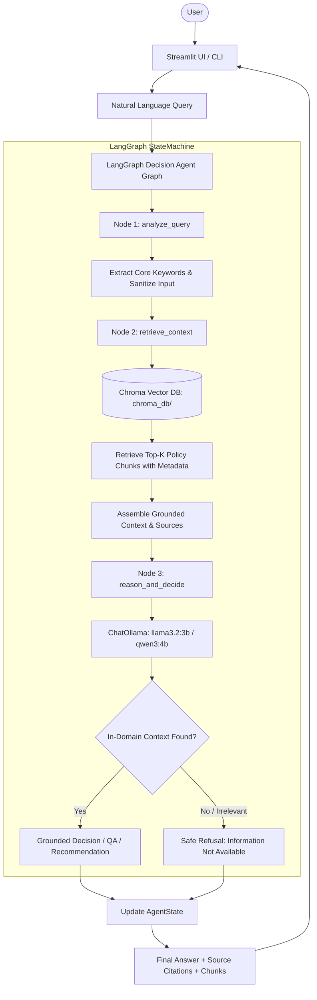
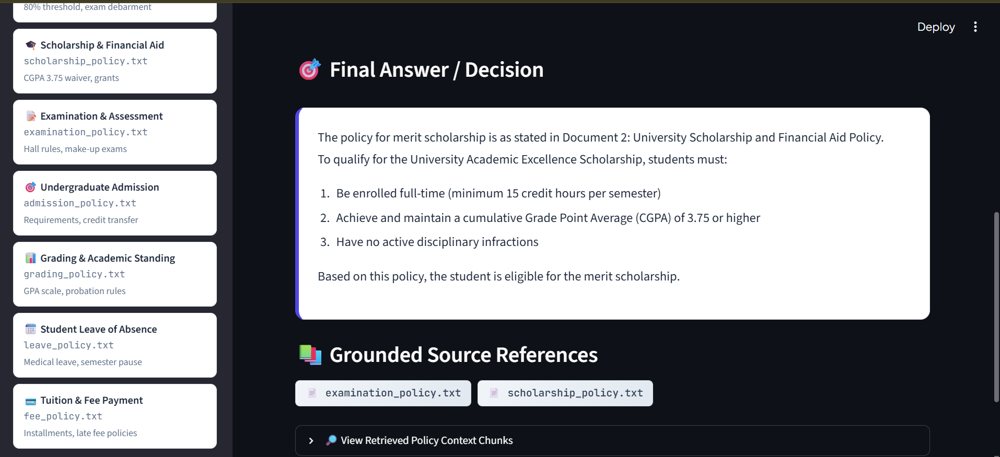
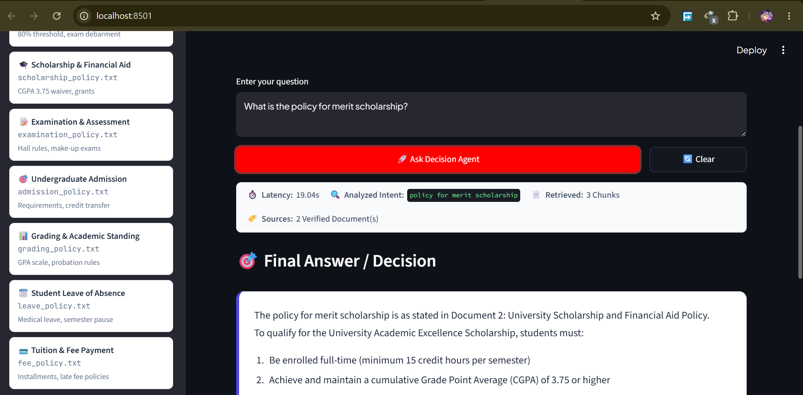
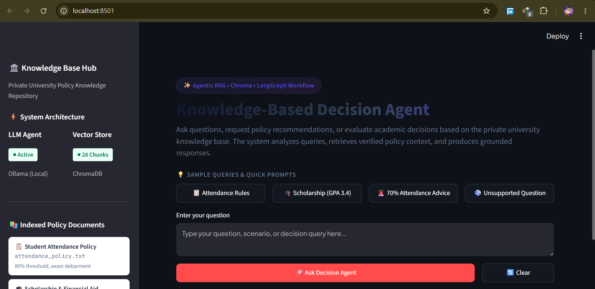

# Knowledge-Based Decision Agent

An enterprise-grade **Agentic RAG (Retrieval-Augmented Generation)** decision support system built with **LangGraph**, **Chroma Vector Database**, **Ollama**, and **Streamlit** to deliver grounded policy answers, student eligibility decisions, and actionable administrative recommendations over a private university knowledge base.

---

## 1. Problem Statement

Standard Large Language Models (LLMs) exhibit severe limitations when deployed in high-stakes organizational, administrative, and institutional settings:

1. **Policy Hallucinations**: Generic LLMs invent non-existent rules, thresholds, and administrative procedures because they lack access to private institutional documentation.
2. **Lack of Verifiable Grounding**: Responses generated by vanilla LLMs lack citations to authoritative documents, making it impossible for students or administrators to verify advice against official university bylaws.
3. **Failure in Decision Analysis**: Traditional conversational chatbots provide generic summaries rather than evaluating concrete student criteria (e.g., comparing a student's CGPA against strict merit scholarship thresholds).
4. **Absence of Guardrails and Safe Refusal**: Standard models attempt to fabricate answers for out-of-domain or unsupported queries rather than safely stating that the requested information is outside the institutional knowledge base.

This project addresses these critical challenges by engineering an **Agentic RAG Architecture** with stateful graph orchestration, semantic vector retrieval, strict contextual grounding, and automated refusal guardrails.

---

## 2. Project Objective

The **Knowledge-Based Decision Agent** provides an autonomous, locally-hosted decision support system designed to:

* Ingest, chunk, and index authoritative university policy documents into a persistent local **Chroma vector database**.
* Execute an autonomous **3-node LangGraph StateGraph pipeline** (`analyze_query` ➔ `retrieve_context` ➔ `reason_and_decide`).
* Accurately answer institutional policy inquiries with precise document source references.
* Provide definitive **eligibility evaluations** (e.g., merit scholarships, exam eligibility).
* Formulate **actionable recommendations** for students facing administrative risks (e.g., attendance debarment mitigation).
* Safely **refuse out-of-domain questions** without hallucinating unverified information.
* Deliver an intuitive, modern user experience via a **Streamlit Web Dashboard** and a **Command-Line Interface (CLI)**.

---

## 3. Main Features

* **3-Node LangGraph State Machine**: Orchestrates query analysis, semantic retrieval, and context-grounded reasoning through a compiled state graph.
* **Persistent Chroma Vector Database**: Pre-indexed semantic store over 7 official university policy documents chunked with recursive character splitting and metadata preservation.
* **Grounded Decision Support**: Evaluates explicit eligibility criteria (e.g., comparing student GPA against scholarship guidelines) strictly based on retrieved context.
* **Proactive Administrative Recommendations**: Identifies policy provisions to guide students toward concrete solutions (e.g., Dean petitions, medical certificate submissions).
* **Deterministic Out-of-Domain Refusal**: Recognizes unsupported questions and safely responds: *"The requested information is not available in the university knowledge base."*
* **100% Local & Privacy-Preserving**: Powered by local Ollama models (`llama3.2:3b` and `qwen3:4b`), guaranteeing that institutional policies and student queries never leave the host environment.
* **Interactive Streamlit Web Dashboard**: Features interactive query inputs, source document badges, collapsible chunk inspectors, session history, and model toggles.
* **Command-Line Interface (CLI)**: Enables direct headless querying for terminal environments and automation scripts.
* **Comprehensive 29-Test Verification Suite**: Automated unit and integration test coverage across all 5 architectural phases.

---

## 4. Agent & Architecture Overview

The system architecture implements an **Agentic RAG** workflow managed through a stateful **LangGraph** execution graph:



### Architectural Components

* **`agent/state.py`**: Defines the strongly-typed `AgentState` schema holding user query, optimized retrieval keywords, retrieved chunks, source filenames, final answer, and error flags.
* **`agent/graph.py`**: Compiles the LangGraph `StateGraph` connecting `analyze_query`, `retrieve_context`, and `reason_and_decide`.
* **`agent/reasoning.py`**: Houses the grounded prompting template enforcing factual fidelity, decision logic, and out-of-domain refusal.
* **`agent/llm.py`**: Centralized factory configuring ChatOllama with multi-threaded CPU acceleration.
* **`rag/vector_store.py`**: Ingests raw policy files, applies recursive text chunking, and persists vectors into ChromaDB.
* **`rag/retriever.py`**: Provides similarity search interface returning top-k policy passages and source document metadata.
* **`rag/embeddings.py`**: Generates deterministic semantic embeddings.
* **`app.py`**: Modern Streamlit web interface featuring real-time query processing, source badges, and chunk inspection.

---

## 5. Technology Stack

| Component | Technology | Purpose |
| :--- | :--- | :--- |
| **Agent Orchestration** | LangGraph (`StateGraph`) | Stateful 3-node agent workflow and execution control |
| **Vector Database** | ChromaDB (`langchain-chroma`) | Persistent local vector store for semantic retrieval |
| **LLM Inference** | Ollama (`llama3.2:3b` / `qwen3:4b`) | Local, privacy-preserving LLM inference |
| **Framework** | LangChain Core & Text Splitters | Message abstractions, document models, and recursive chunking |
| **Web Interface** | Streamlit | Modern dashboard with source badges and chunk inspector |
| **Validation** | Pydantic & python-dotenv | Strongly-typed state management and environment configuration |
| **Testing** | Python `unittest` & `AppTest` | Automated unit, integration, and UI test suite (29 tests) |

---

## 6. Project Structure

```
knowledge-based-decision-agent/
│
├── app.py                      # Streamlit web application & visualizer
├── requirements.txt            # Runtime dependencies with pinned minimum versions
├── README.md                   # Comprehensive project documentation
├── .gitignore                  # Git ignore rules for caches, vector stores, and envs
├── .env.example                # Environment variables template
│
├── agent/                      # Agentic orchestration & graph modules
│   ├── __init__.py             # Agent package exports
│   ├── graph.py                # LangGraph 3-node compiled pipeline & CLI runner
│   ├── llm.py                  # ChatOllama factory with CPU optimization
│   ├── reasoning.py            # Grounded LLM reasoning, decision, & refusal logic
│   └── state.py                # Strongly-typed AgentState TypedDict schema
│
├── rag/                        # RAG retrieval & indexing pipeline
│   ├── __init__.py             # RAG package exports
│   ├── embeddings.py           # Local semantic embeddings generator
│   ├── loader.py               # Document loader with metadata extraction
│   ├── retriever.py            # Top-k Chroma retriever interface
│   ├── splitter.py             # Recursive text chunking with overlap
│   └── vector_store.py         # Knowledge base builder & Chroma indexer
│
├── data/                       # Authoritative university policy documents
│   ├── admission_policy.txt    # Admission criteria, eligibility, and deadlines
│   ├── attendance_policy.txt   # Mandatory 80% rule, debarment, and medical excuses
│   ├── examination_policy.txt  # Exam hall regulations, missed finals, and make-up rules
│   ├── fee_policy.txt          # Tuition schedules, refund policies, and installment plans
│   ├── grading_policy.txt      # GPA scale, letter grades, probation, and repeat policies
│   ├── leave_policy.txt        # Semester freeze, leave of absence, and medical leaves
│   └── scholarship_policy.txt  # Merit scholarships, need-based aid, and CGPA thresholds
│
├── config/                     # Configuration management
│   └── __init__.py             # Environment bindings & system defaults
│
└── tests/                      # Automated test suites (29 tests)
    ├── __init__.py             # Tests package exports
    ├── test_environment.py     # Phase 0: Dependencies, structure, & Ollama probe (6 tests)
    ├── test_rag_retrieval.py   # Phase 1: Chroma indexing, chunking, & retrieval (8 tests)
    ├── test_agent_graph.py     # Phase 2: LangGraph nodes, state updates, & routing (5 tests)
    ├── test_agent_reasoning.py # Phase 3: Factual QA, decisions, recommendations, & refusal (5 tests)
    └── test_streamlit_app.py   # Phase 4: Streamlit UI rendering & interaction tests (5 tests)
```

---

## 7. Knowledge Base Policy Documents

The system indexes 7 institutional policy documents in `data/`:

1. **`admission_policy.txt`**: Undergraduate/graduate eligibility, transfer credits, and prerequisite evaluation.
2. **`attendance_policy.txt`**: Strict 80% attendance mandate, debarment consequences, and medical excuse procedures.
3. **`examination_policy.txt`**: Examination hall conduct, cheating penalties, and missed exam make-up petitions.
4. **`fee_policy.txt`**: Tuition fee payment deadlines, late surcharges, refund schedules, and financial holds.
5. **`grading_policy.txt`**: 4.0 grading scale, letter grade mappings, academic warning, and probation rules.
6. **`leave_policy.txt`**: Official leaves of absence, medical leave limits, and maximum semester freeze allowances.
7. **`scholarship_policy.txt`**: Merit scholarships (3.75 CGPA threshold for 50% tuition waiver), need-based aid criteria, and renewal terms.

---

## 8. Installation & Setup Instructions

### Prerequisites

1. **Python 3.10+** installed on your system.
2. **Ollama** installed and running locally ([https://ollama.com](https://ollama.com)).

### Step 1: Clone the Repository

```bash
git clone <repository-url>
cd knowledge-based-decision-agent
```

### Step 2: Set Up Virtual Environment

**Windows (PowerShell):**
```powershell
python -m venv .venv
.venv\Scripts\Activate.ps1
```

**Linux / macOS:**
```bash
python3 -m venv .venv
source .venv/bin/activate
```

### Step 3: Install Dependencies

```bash
pip install -r requirements.txt
```

### Step 4: Pull Required Local Ollama Models

Ensure the Ollama service is active (`ollama serve`), then pull the required models:

```bash
# Recommended for ultra-fast CPU inference
ollama pull llama3.2:3b

# Deep reasoning model (default configuration)
ollama pull qwen3:4b
```

### Step 5: Configure Environment Variables

```bash
cp .env.example .env
```

### Step 6: Build & Index Knowledge Base

Build the Chroma vector database from the raw policy files in `data/`:

```bash
python -m rag.vector_store
```

Expected output:
```
[Indexing] Loaded 7 documents -> 28 chunks.
[Indexing] Successfully indexed 28 chunks into Chroma collection 'university_knowledge_base'.
```

---

## 9. Environment Variables & Configuration

Configuration is managed in `config/__init__.py` with defaults:

| Variable Name | Default Value | Description |
| :--- | :--- | :--- |
| `OLLAMA_BASE_URL` | `http://localhost:11434` | Ollama API endpoint |
| `OLLAMA_MODEL` | `qwen3:4b` | Default LLM model identifier |
| `EMBEDDING_MODEL` | `nomic-embed-text` | Embedding model identifier |
| `CHROMA_PERSIST_DIRECTORY` | `./chroma_db` | Persistent vector store path |
| `COLLECTION_NAME` | `knowledge_base` | Chroma collection name |
| `APP_NAME` | `Knowledge-Based Decision Agent` | Application title |
| `APP_ENV` | `development` | Runtime environment |

> **Privacy & Security Note:**  
> This system operates **100% locally and keylessly**. No cloud API keys, external tokens, or third-party web calls are required.

---

## 10. How to Run the Application

### Option A: Web Application (Streamlit)

Launch the interactive dashboard:

```bash
streamlit run app.py
```

Access via browser at: **`http://localhost:8501`**

### Option B: Command-Line Interface (CLI)

Query the agent directly from your terminal:

```bash
python -m agent.graph "What are the attendance requirements for students?"
```

---

## 11. Usage Examples

### Example 1: Policy Question Answering
* **Query**: `"What are the attendance requirements and penalties for students?"`
* **Sources Cited**: `attendance_policy.txt`
* **Grounded Output**:  
  > *"Students must maintain a minimum of 80% attendance in each registered course. Falling below 80% results in being debarred from the final examination and receiving an 'F' grade in the course."*

### Example 2: Eligibility Decision Support
* **Query**: `"Based on the scholarship policy, am I eligible for the merit scholarship if my GPA is 3.4?"`
* **Sources Cited**: `scholarship_policy.txt`
* **Grounded Output**:  
  > *"No, you are not eligible for the university merit scholarship. The scholarship policy requires a minimum Cumulative GPA (CGPA) of 3.75 with no disciplinary record. A GPA of 3.4 falls below this mandatory threshold."*

### Example 3: Policy-Grounded Recommendation
* **Query**: `"I currently have 70% attendance. Based on the university policy, what should I do before the examination?"`
* **Sources Cited**: `attendance_policy.txt`
* **Grounded Output**:  
  > *"Because your attendance is 70% (below the mandatory 80% threshold), you are at risk of debarment. According to university policy, you should immediately submit official medical certificates or documented extenuating circumstances to the Student Services Office, and submit a formal petition to the Dean of Academic Affairs before the examination period begins."*

### Example 4: Examination Make-Up Policy
* **Query**: `"What are the rules for missed final examinations and make-up exams?"`
* **Sources Cited**: `examination_policy.txt`
* **Grounded Output**:  
  > *"Make-up examinations are only granted for documented medical emergencies or severe compassionate grounds. The student must file a petition with the Dean within 48 hours of the missed examination. If approved, the make-up exam is scheduled within two weeks of the semester's conclusion."*

### Example 5: Out-of-Domain Refusal & Safety Guardrail
* **Query**: `"Who won the FIFA World Cup in 2022?"`
* **Sources Cited**: None (Irrelevant)
* **Grounded Output**:  
  > *"The requested information is not available in the university knowledge base. I can only assist with official university policies, regulations, and academic decision support."*

---

## 12. Testing & Verification

The project contains **29 automated tests** organized across 5 architectural tiers:

| Test Module | Phase | Focus Area | Tests | Status |
| :--- | :---: | :--- | :---: | :---: |
| **`tests/test_environment.py`** | Phase 0 | Python version, package imports, structure, Ollama connectivity | 6 | PASS |
| **`tests/test_rag_retrieval.py`** | Phase 1 | Document loading, chunking, Chroma indexing, metadata, top-k retrieval | 8 | PASS |
| **`tests/test_agent_graph.py`** | Phase 2 | LangGraph node compilation, keyword extraction, state flow | 5 | PASS |
| **`tests/test_agent_reasoning.py`** | Phase 3 | Factual QA, eligibility decisions, recommendations, safe refusal | 5 | PASS |
| **`tests/test_streamlit_app.py`** | Phase 4 | Streamlit rendering, empty input validation, UI question execution | 5 | PASS |
| **Total** | | | **29** | **100% PASS** |

### Running the Entire Test Suite

```bash
python -m unittest discover tests
```

### Running Fast Tests (Environment & RAG Indexing)

```bash
python -m unittest tests/test_environment.py tests/test_rag_retrieval.py
```

---

## 13. Limitations

1. **Host CPU Performance**: Generating deep reasoning responses using `qwen3:4b` on CPU-only hardware may take 20–40 seconds per complex query. Switching to `llama3.2:3b` in the sidebar provides 4x faster responses on multi-core CPUs.
2. **Domain Boundary**: The agent's knowledge is bounded by the 7 official policy documents in `data/`. Adding new policies requires adding text files to `data/` and running `python -m rag.vector_store`.
3. **Retrieval Chunk Size**: Configured to 500 characters with 100 character overlap to optimize semantic density and prevent irrelevant context pollution.

---

---

## 14. Application Screenshots

| Initial UI & Policy Selection | Student Query & Decision Output |
| :---: | :---: |
|  |  |
| *Streamlit Policy Portal & Query Interface* | *LangGraph Reasoning & Policy Evaluation* |

<br/>

| Decision Breakdown & Citations |
| :---: |
|  |
| *Context Retrieval, Decision Analysis & Official Policy Citations* |

---

## 15. License

Developed for academic course submission under the MIT License.