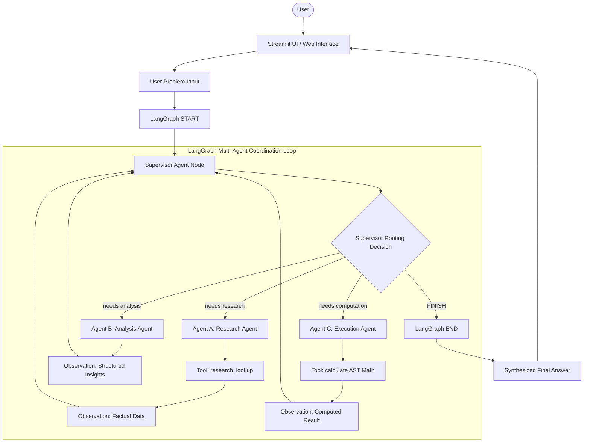

# Multi-Agent Problem Solving System

An enterprise-grade **Multi-Agent Problem Solving Architecture** built with **LangGraph**, **LangChain**, local **Ollama** LLMs (`llama3.2:3b`), and **Streamlit** to coordinate specialized autonomous agents under an intelligent Supervisor for multi-step task decomposition, data retrieval, analytical synthesis, and safe arithmetic computation.

---

## 1. Problem Statement

Monolithic, single-agent AI systems encounter severe cognitive bottlenecks and operational failures when tasked with multifaceted, heterogeneous real-world problems:

1. **Role Conflation & Context Pollution**: When a single prompt forces an agent to simultaneously research facts, evaluate qualitative comparisons, and execute quantitative computations, the model frequently confounds retrieved facts with analytical deductions.
2. **Computational Inaccuracy**: Standard LLMs hallucinate calculations when performing arithmetic directly in generation text rather than delegating math to a deterministic computational engine.
3. **Lack of Dynamic Delegation**: Linear single-agent loops cannot adapt their execution path based on the specific type of task required (e.g. knowing when a task requires only qualitative comparison vs. when it requires multi-step research followed by quantitative computation).
4. **Fragile Error Handling**: Without clear boundaries, an error in one sub-task (such as a division by zero) can crash the entire reasoning trajectory.

This project solves these limitations by implementing a **Hierarchical Multi-Agent Architecture** utilizing **LangGraph**: an autonomous Supervisor agent dynamically inspects incoming goals and delegates sub-tasks to dedicated, role-specific agents (**Research**, **Analysis**, and **Execution**), collecting observations iteratively before synthesizing a grounded final answer.

---

## 2. Project Objective

The **Multi-Agent Problem Solving System** provides an end-to-end autonomous coordination system designed to:

* Accept complex, multi-faceted natural language problems from users.
* Employ an intelligent **Supervisor Agent** to analyze task requirements and dynamically route execution to specialized agents.
* Deploy **Agent A (Research Agent)** to perform deterministic information retrieval via `research_lookup` tool calling.
* Deploy **Agent B (Analysis Agent)** to synthesize research context and formulate structured insights.
* Deploy **Agent C (Execution Agent)** to evaluate quantitative formulas using safe AST arithmetic (`calculate` tool calling).
* Enable a **cyclic feedback loop** via LangGraph's `StateGraph` where specialized agents report observations back to the Supervisor until the problem is fully resolved.
* Present execution steps, tool invocations, agent observations, and final responses through a modern **Streamlit Web Dashboard**.

---

## 3. Main Features

* **Intelligent Supervisor Orchestration**: Dynamic task evaluation routing tasks between Research, Analysis, Execution, or concluding with `FINISH`.
* **Agent A — Research Agent**: Gathers verified factual information and technical comparisons using structured `research_lookup` tool calling.
* **Agent B — Analysis Agent**: Produces concise, structured key findings, technical interpretations, and actionable recommendations.
* **Agent C — Execution Agent**: Computes arithmetic formulas deterministically using Python Abstract Syntax Tree (AST) safe evaluation (`calculate` tool calling).
* **Cyclic LangGraph State Machine**: Implements conditional edges where specialized agents route their observations back to the Supervisor for iterative decision-making.
* **Deterministic Tool Calling**: Tools use AST safety verification to reject arbitrary code execution and division-by-zero errors.
* **100% Local & Privacy-Preserving**: Runs completely locally on Ollama (`llama3.2:3b`), ensuring zero cloud dependencies, zero latency delays, and zero data leakage.
* **Modern Streamlit Web Dashboard**: Features custom glassmorphism styling, real-time agent execution streaming, status badges, metrics bar, and collapsible observation inspectors.
* **Automated Test Suite**: Comprehensive `pytest` test suite covering tools, individual agent nodes, workflow transitions, and Streamlit UI components.

---

## 4. Architecture & Workflow

The system implements a **Hierarchical Multi-Agent StateGraph** orchestrated via **LangGraph**:



### Component Breakdown

* **`workflow/state.py`**: Defines the shared `MultiAgentState` schema (`TypedDict`) tracking the problem, active agent, routing target, agent outputs, accumulated observation logs, and step counts.
* **`workflow/graph.py`**: Compiles the LangGraph `StateGraph`, binding the entry point (`START` ➔ `supervisor`), conditional edges from the Supervisor, and return edges from specialized agents back to the Supervisor.
* **`agents/supervisor.py`**: Contains `supervisor_node` and `route_supervisor` logic that evaluates accumulated state to determine the next operational node or `FINISH`.
* **`agents/research.py`**: Research agent utilizing `research_lookup` tool binding to gather technical comparisons or pricing benchmarks.
* **`agents/analysis.py`**: Analysis agent synthesizing findings into structured insights without exposing internal reasoning tags.
* **`agents/execution.py`**: Execution agent executing arithmetic expressions via `calculate` tool binding.
* **`tools/tools.py`**: Safe AST mathematical evaluator (`calculate`) and deterministic factual retrieval tool (`research_lookup`).
* **`config.py`**: Centralized LLM factory configuring ChatOllama with environment defaults.
* **`app.py`**: Streamlit presentation dashboard displaying the multi-agent execution pipeline in real time.

---

## 5. Technology Stack

| Component | Technology | Purpose |
| :--- | :--- | :--- |
| **Multi-Agent Orchestration** | LangGraph (`StateGraph`) | Stateful cyclic graph coordination between Supervisor and agents |
| **LLM Inference** | Ollama (`llama3.2:3b`) | Local, high-speed multi-threaded CPU inference |
| **Agent Framework** | LangChain Core & Ollama | Tool binding, message abstractions, and prompt templates |
| **Deterministic Math** | Python AST (`ast`, `operator`) | Safe arithmetic evaluation rejecting code injection |
| **User Interface** | Streamlit | Glassmorphic web UI with live agent trace visualization |
| **Configuration** | python-dotenv & Pydantic | Typed schemas and centralized environment management |
| **Automated Testing** | pytest & Streamlit AppTest | Unit, integration, and UI testing |

---

## 6. Project Structure

```
Project-3/
│
├── app.py                      # Streamlit web application & multi-agent visualizer
├── config.py                   # Centralized Ollama LLM initialization & settings
├── requirements.txt            # Runtime dependencies with pinned minimum versions
├── README.md                   # Comprehensive project documentation
├── .gitignore                  # Git ignore rules for caches, virtualenvs, and envs
├── .env.example                # Environment variables template
│
├── agents/                     # Specialized agent implementations
│   ├── __init__.py             # Agents package exports
│   ├── supervisor.py           # Supervisor agent routing, orchestration, & synthesis
│   ├── research.py             # Agent A: Research & factual data lookup
│   ├── analysis.py             # Agent B: Analytical synthesis & structured insights
│   └── execution.py            # Agent C: Computational & arithmetic execution
│
├── workflow/                   # LangGraph coordination workflow
│   ├── __init__.py             # Workflow package exports
│   ├── graph.py                # StateGraph builder, conditional routing, & runner
│   └── state.py                # MultiAgentState TypedDict schema definition
│
├── tools/                      # Tool registry & definitions
│   ├── __init__.py             # Tools package exports
│   └── tools.py                # Safe AST math (calculate) & research_lookup tools
│
└── tests/                      # Automated test suite
    ├── __init__.py             # Tests package exports
    ├── test_tools.py           # Unit tests for AST math and research lookup tools
    ├── test_agents.py          # Unit tests for individual agent nodes
    ├── test_workflow.py        # Integration tests for LangGraph routing and collaboration
    └── test_streamlit_app.py   # Streamlit UI integration and input validation tests
```

---

## 7. Specialized Agents Specification

### 1. Supervisor Agent (`agents/supervisor.py`)
* **Role**: Primary orchestrator and final synthesizer.
* **Routing Logic**: Dynamically determines whether the problem requires `research`, `analysis`, `execution`, or `FINISH`.
* **Synthesis**: Synthesizes all gathered observations into a unified, professional user-facing response.

### 2. Agent A: Research Agent (`agents/research.py`)
* **Role**: Data and fact gathering.
* **Tool**: `research_lookup(query: str)`
* **Capabilities**: Retrieves technical comparisons (e.g. Python vs. JavaScript) and catalog pricing information.

### 3. Agent B: Analysis Agent (`agents/analysis.py`)
* **Role**: Qualitative evaluation and contextual synthesis.
* **Capabilities**: Evaluates research observations, compares architectural tradeoffs, and structures key findings for the Supervisor.

### 4. Agent C: Execution Agent (`agents/execution.py`)
* **Role**: Quantitative computation and formula execution.
* **Tool**: `calculate(expression: str)`
* **Capabilities**: Evaluates arithmetic expressions deterministically (rejecting non-math syntax and division by zero).

---

## 8. Installation & Setup Instructions

### Prerequisites

1. **Python 3.10+** installed on your system.
2. **Ollama** installed and running locally ([https://ollama.com](https://ollama.com)).

### Step 1: Clone the Repository

```bash
git clone <repository-url>
cd Project-3
```

### Step 2: Set Up Virtual Environment

**Windows (PowerShell):**
```powershell
python -m venv .venv
.venv\Scripts\Activate.ps1
```

**Linux / macOS:**
```bash
python3 -m venv .venv
source .venv/bin/activate
```

### Step 3: Install Dependencies

```bash
pip install -r requirements.txt
```

### Step 4: Pull Required Local Ollama Model

```bash
ollama pull llama3.2:3b
```

### Step 5: Configure Environment Variables

```bash
cp .env.example .env
```

---

## 9. Environment Variables & Configuration

Configuration is managed in `config.py` using `python-dotenv`:

| Variable Name | Default Value | Description |
| :--- | :--- | :--- |
| `OLLAMA_MODEL` | `llama3.2:3b` | Local Ollama model identifier |
| `OLLAMA_BASE_URL` | `http://localhost:11434` | Ollama service endpoint |
| `TEMPERATURE` | `0.0` | Sampling temperature (`0.0` for deterministic routing) |

> **Privacy & Security Note:**  
> This system operates **100% locally and keylessly**. No cloud API keys, external tokens, or third-party web calls are required.

---

## 10. How to Run the Application

Launch the interactive Streamlit dashboard:

```bash
streamlit run app.py
```

Access via your web browser at: **`http://localhost:8501`**

### UI Features
* **Select Preset Scenarios**: Click quick prompt buttons (Research + Analysis, Pure Execution, Multi-Agent Collaboration) to auto-populate the input area.
* **Real-Time Agent Stepper**: Live tracking showing which specialized agent is actively running.
* **Collapsible Observation Cards**: Inspect the exact tool calls, arguments, and return values for each agent.
* **Final Synthesis Card**: View the Supervisor's comprehensive, grounded answer.

---

## 11. Usage Scenarios & Examples

### Scenario 1: Research + Analysis Workflow
* **Input**: `"Compare Python and JavaScript for beginner web development."`
* **Execution Path**: `Supervisor` ➔ `Research Agent` (`research_lookup`) ➔ `Supervisor` ➔ `Analysis Agent` ➔ `Supervisor` ➔ `FINISH`
* **Output**: Structured comparison of language paradigms, backend vs. frontend suitability, learning curves, and concrete recommendations for beginners.

### Scenario 2: Pure Execution Workflow
* **Input**: `"Calculate the total cost of 15 items at $24 each and explain the result."`
* **Execution Path**: `Supervisor` ➔ `Execution Agent` (`calculate: '15 * 24'`) ➔ `Supervisor` ➔ `FINISH`
* **Output**: Exact computed total of $360 with contextual explanation.

### Scenario 3: Full Multi-Agent Collaboration
* **Input**: `"Research the average price information provided by the available research data, analyze it, and calculate the total for 3 units."`
* **Execution Path**: `Supervisor` ➔ `Research Agent` (retrieves $24.00 benchmark) ➔ `Supervisor` ➔ `Analysis Agent` (structures catalog insight) ➔ `Supervisor` ➔ `Execution Agent` (`calculate: '3 * 24.00'`) ➔ `Supervisor` ➔ `FINISH`
* **Output**: Comprehensive answer integrating retrieved catalog prices, analytical reasoning, and verified mathematical computation ($72.00).

### Scenario 4: Error Recovery
* **Input**: `"Calculate 100 / 0"`
* **Execution Path**: `Supervisor` ➔ `Execution Agent` (`calculate: '100 / 0'`) ➔ `Supervisor` ➔ `FINISH`
* **Output**: Clean error handling indicating that division by zero is mathematically undefined, without system crash.

---

## 12. Testing & Verification

The project includes an automated test suite executed via `pytest`:

| Test Module | Focus Area | Status |
| :--- | :--- | :---: |
| **`tests/test_tools.py`** | Safe AST math, division by zero, code injection rejection, research lookup | PASS |
| **`tests/test_agents.py`** | Research node, analysis node, execution node tool calling, empty input handling | PASS |
| **`tests/test_workflow.py`** | LangGraph construction, Research+Analysis flow, Execution flow, 3-Agent collaboration | PASS |
| **`tests/test_streamlit_app.py`** | Streamlit initial rendering, empty input validation, end-to-end execution | PASS |

### Running the Full Test Suite

```bash
pytest tests/ -v
```

### Running Fast Tool Tests

```bash
pytest tests/test_tools.py -v
```

---

## 13. Limitations

1. **Host CPU Performance**: Inference is governed by local CPU/RAM capabilities. While `llama3.2:3b` completes typical agent steps in 2–5 seconds on modern multi-core processors, running larger models without GPU acceleration will increase latency.
2. **Catalog Research Scope**: The built-in research tool indexes a deterministic dataset for technical comparisons and pricing benchmarks. Expanding to web search or custom databases can be achieved by registering additional tools in `tools/tools.py`.
3. **Step Limit**: The Supervisor is configured to terminate within 10 execution cycles to prevent runaway loops on ambiguous queries.

---

## 14. License

Developed for academic course submission under the MIT License.