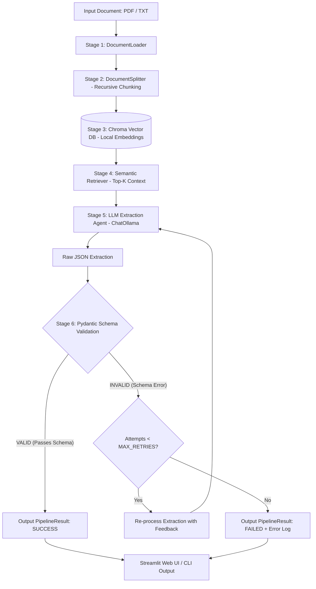

# Intelligent Document Processing & Validation Pipeline

An enterprise-grade, automated **Document Extraction & Validation Pipeline (DocFlow AI)** built with **LangChain**, **Chroma Vector Database**, **Ollama LLM** (`llama3.2:3b`), **Pydantic**, and **Streamlit** to ingest unstructured business documents (Invoices, Receipts, Contracts in PDF/TXT), perform semantic RAG retrieval, extract structured JSON data, and enforce deterministic schema validation with an automated retry loop.

---

## 1. Problem Statement

Organizations process millions of business-critical documents annually—such as invoices, bills, purchase orders, and contracts—that arrive in unstructured or semi-structured formats (PDFs, text files, scans):

1. **Manual Data Entry Bottlenecks**: Manual transcription is expensive, slow, and incurs high error rates that disrupt accounting and supply chain operations.
2. **Template Fragility in Traditional OCR**: Traditional rule-based optical character recognition (OCR) systems break whenever layout templates, column orders, or font styles change.
3. **LLM Hallucinations & Formatting Errors**: Out-of-the-box LLMs frequently hallucinate missing values, output malformed JSON, omit required fields, or miscalculate financial line items when processing lengthy unstructured text.
4. **Lack of Automated Self-Correction**: Standard extraction pipelines execute a single pass with no verification mechanism to detect schema violations or retry extraction when validation fails.

This project solves these limitations by implementing a **Multi-Stage Intelligent Document Processing Pipeline**: ingesting documents, splitting text semantically, performing focused context retrieval via ChromaDB, extracting structured fields using an LLM agent, validating data deterministically against strict Pydantic schemas, and triggering an automated **re-processing loop** upon validation failure.

---

## 2. Project Objective

The **Automated Document Processing Pipeline** delivers an autonomous, locally-hosted pipeline designed to:

* Ingest multi-format documents (PDF and TXT) with automatic format detection and metadata preservation.
* Apply recursive semantic text chunking to maintain context without exceeding token windows.
* Store and index document chunks in a local **Chroma vector database**.
* Perform targeted semantic context retrieval using a domain-optimized query.
* Extract structured data into a strongly-typed schema (`InvoiceSchema`) containing document type, invoice number, date, customer name, line items, and grand totals.
* Validate all extracted fields deterministically using **Pydantic v2** validation rules.
* Execute an automated **re-processing retry loop** (up to `MAX_RETRIES`) if initial extraction fails schema validation.
* Provide an interactive, glassmorphic **Streamlit Web Application** and a **Command-Line Interface (CLI)**.

---

## 3. Main Features

* **Multi-Format Ingestion**: Ingests both `.txt` and `.pdf` documents via LangChain's `TextLoader` and `PyPDFLoader` with full metadata tagging (filename, file type, page numbers).
* **Semantic Text Chunking**: Employs `RecursiveCharacterTextSplitter` configured with optimal chunk size (400 characters) and overlap (50 characters) to prevent fragmenting key-value pairs.
* **Chroma Vector Store Integration**: Generates embeddings and persists document representations in a local Chroma vector database for high-precision semantic search.
* **Domain-Optimized RAG Retrieval**: Retrieves the top-`k` relevant chunks containing invoice headers, line-item tables, and totals.
* **LLM Extraction Agent**: Uses local Ollama (`llama3.2:3b`) with prompt engineering that enforces strict JSON formatting without conversational filler.
* **Strict Pydantic Schema Validation**: Validates non-empty strings, positive line-item quantities, positive prices, valid totals, and cross-field consistency (`InvoiceItem`, `InvoiceSchema`).
* **Self-Correcting Retry Loop**: Detects validation failures and automatically re-processes the extraction with feedback up to `MAX_RETRIES`.
* **DocFlow AI Streamlit Web Dashboard**: Features drag-and-drop file upload, pipeline stage progress tracking, interactive JSON viewers, structured line-item tables, and status badges.
* **Headless CLI Runner**: `run_pipeline.py` script for terminal execution and automated CI/CD workflows.
* **Automated Test Suite**: 15 unit and integration tests covering document loading, chunking, Chroma indexing, semantic retrieval, extraction, Pydantic validation, error handling, and UI rendering.

---

## 4. Pipeline Architecture & Workflow

The pipeline executes a 6-stage sequential workflow with an automated self-correcting feedback loop:



### Component Breakdown

* **`src/document_loader.py`**: Validates file existence and delegates to `TextLoader` or `PyPDFLoader` based on file extension.
* **`src/text_splitter.py`**: Splits raw documents into chunks while preserving source metadata.
* **`src/vector_store.py`**: Manages ephemeral and persistent Chroma vector stores and handles cosine similarity retrieval.
* **`src/extractor.py`**: Formats extraction prompts, invokes ChatOllama, and sanitizes markdown code blocks into valid JSON.
* **`src/validator.py`**: Validates raw JSON dictionaries against the `InvoiceSchema` model and collects detailed validation error messages.
* **`src/schema.py`**: Pydantic models defining `InvoiceItem`, `InvoiceSchema`, `ValidationResult`, and `PipelineResult`.
* **`src/pipeline.py`**: Top-level coordinator managing the complete end-to-end flow and retry execution loop.
* **`src/config.py`**: Centralized configuration parameters (chunk size, retriever `k`, timeout, model names).
* **`app.py`**: Streamlit application with custom modern CSS and interactive result inspection.
* **`run_pipeline.py`**: Command-line entry point for direct file processing.

---

## 5. Technology Stack

| Component | Technology | Purpose |
| :--- | :--- | :--- |
| **Pipeline Coordination** | Python 3.11+ / LangChain | Modular pipeline construction and document abstractions |
| **Vector Database** | ChromaDB (`langchain-chroma`) | Local vector storage and semantic context retrieval |
| **LLM Inference** | Ollama (`llama3.2:3b`) | Local, privacy-preserving structured JSON extraction |
| **Schema Validation** | Pydantic v2 (`BaseModel`) | Strict field validation, type checking, and error reporting |
| **Document Loaders** | `pypdf` & LangChain Community | Ingestion of `.pdf` and `.txt` files |
| **User Interface** | Streamlit & Pandas | Web UI, data tables, and pipeline execution visualizer |
| **Testing** | pytest & Streamlit AppTest | Automated unit, integration, and UI testing (15 tests) |

---

## 6. Project Structure

```
Project-4/
│
├── app.py                      # Streamlit web application (DocFlow AI)
├── run_pipeline.py             # CLI runner for terminal execution
├── requirements.txt            # Runtime dependencies with pinned versions
├── README.md                   # Comprehensive project documentation
├── .gitignore                  # Git ignore rules for caches, vector stores, and envs
├── .env.example                # Environment variables template
│
├── sample_documents/           # Test documents
│   ├── sample_invoice.txt      # Text-based invoice sample
│   └── sample_invoice.pdf      # PDF invoice sample
│
├── src/                        # Core pipeline modules
│   ├── __init__.py             # Package exports
│   ├── config.py               # Centralized configuration and path constants
│   ├── document_loader.py      # PDF & TXT document loading with metadata
│   ├── text_splitter.py        # Recursive text chunking with overlap
│   ├── vector_store.py         # Chroma vector store manager & retriever
│   ├── extractor.py            # LLM-based structured JSON extractor
│   ├── validator.py            # Pydantic schema validation & error capture
│   ├── schema.py               # Strongly-typed Pydantic schemas (InvoiceSchema, etc.)
│   └── pipeline.py             # End-to-end pipeline coordinator with retry logic
│
└── tests/                      # Automated test suite (15 tests)
    ├── __init__.py             # Tests package exports
    ├── test_pipeline.py        # Unit and integration tests (Loading, Chunking, DB, Validation, Retries)
    └── test_app.py             # Streamlit UI integration and upload tests
```

---

## 7. Pydantic Schema Specification

The pipeline enforces structured data extraction using **Pydantic v2**:

```python
class InvoiceItem(BaseModel):
    description: str          # Must be non-empty string
    quantity: int             # ge=1 (must be at least 1)
    unit_price: float         # ge=0.0 (non-negative)
    total: float              # ge=0.0 (non-negative)

class InvoiceSchema(BaseModel):
    document_type: str        # e.g., 'Invoice'
    invoice_number: str       # e.g., 'INV-2024-001'
    date: str                 # e.g., '2024-03-15'
    customer_name: str        # e.g., 'TechCorp Solutions Inc.'
    items: List[InvoiceItem]  # Must contain at least one item
    total_amount: float       # Must be greater than 0
```

---

## 8. Installation & Setup Instructions

### Prerequisites

1. **Python 3.10+** installed on your system.
2. **Ollama** installed and running locally ([https://ollama.com](https://ollama.com)).

### Step 1: Clone the Repository

```bash
git clone <repository-url>
cd Project-4
```

### Step 2: Set Up Virtual Environment

**Windows (PowerShell):**
```powershell
python -m venv .venv
.venv\Scripts\Activate.ps1
```

**Linux / macOS:**
```bash
python3 -m venv .venv
source .venv/bin/activate
```

### Step 3: Install Dependencies

```bash
pip install -r requirements.txt
```

### Step 4: Pull Required Local Ollama Model

```bash
ollama pull llama3.2:3b
```

### Step 5: Configure Environment Variables

```bash
cp .env.example .env
```

---

## 9. How to Run the Application

### Option A: Web Application (Streamlit)

Launch the interactive dashboard:

```bash
streamlit run app.py
```

Access via your web browser at: **`http://localhost:8501`**

#### Web UI Walkthrough:
1. **Upload Document**: Drag and drop any `.txt` or `.pdf` invoice (or select from `sample_documents/`).
2. **Click Process Document**: Watch the real-time pipeline status tracker.
3. **Inspect Output**:
   - **Validation Status**: `SUCCESS` badge with total attempts and reprocessing status.
   - **Structured Line Items**: Rendered in a formatted Pandas table.
   - **Raw JSON Viewer**: Copyable structured JSON.
   - **Retrieved Context Chunks**: Inspect the exact text passages retrieved from ChromaDB.

### Option B: Command-Line Interface (CLI)

Process any document directly from your terminal:

```bash
# Process default sample invoice
python run_pipeline.py

# Process specific document
python run_pipeline.py sample_documents/sample_invoice.pdf
```

---

## 10. Sample Execution Output

```json
{
  "document_type": "Invoice",
  "invoice_number": "INV-2024-001",
  "date": "2024-03-15",
  "customer_name": "TechCorp Solutions Inc.",
  "items": [
    {
      "description": "Cloud Architecture Consultation",
      "quantity": 10,
      "unit_price": 150.0,
      "total": 1500.0
    },
    {
      "description": "Kubernetes Cluster Deployment",
      "quantity": 1,
      "unit_price": 2500.0,
      "total": 2500.0
    },
    {
      "description": "DevOps CI/CD Automation",
      "quantity": 5,
      "unit_price": 200.0,
      "total": 1000.0
    }
  ],
  "total_amount": 5000.0
}
```

---

## 11. Testing & Verification

The automated test suite covers all pipeline stages:

| Test Group | Focus Area | Status |
| :--- | :--- | :---: |
| **Document Loading** | TXT loading, PDF loading, nonexistent file handling | PASS |
| **Text Chunking** | Recursive character chunking, metadata preservation | PASS |
| **Chroma Vector Store** | Ephemeral client creation, embedding storage | PASS |
| **Semantic Retrieval** | Targeted RAG retrieval of invoice context | PASS |
| **LLM Extraction** | JSON generation from invoice text passages | PASS |
| **Pydantic Validation** | Valid schema acceptance, field type enforcement | PASS |
| **Error Handling & Retries** | Invalid data rejection, error message capture, max retries enforcement | PASS |
| **Streamlit UI** | Initial render, empty upload warnings, end-to-end upload processing | PASS |

### Running the Full Test Suite

```bash
pytest tests/ -v
```

### Running Pipeline Unit Tests

```bash
pytest tests/test_pipeline.py -v
```

---

## 12. Limitations

1. **Scanned Image PDFs**: The current document loader processes text-based PDFs and TXT files natively using `pypdf`. Processing scanned images or non-searchable bitmap PDFs requires integrating an external OCR engine (such as Tesseract or AWS Textract).
2. **Host CPU Performance**: Inference latency is governed by local CPU/RAM specs. While `llama3.2:3b` processes typical invoices in 3–6 seconds on modern multi-core processors, running on constrained hardware will increase processing time.
3. **Domain Customization**: The extraction schema is currently tailored for invoices. Supporting receipts, medical records, or legal contracts requires defining corresponding Pydantic schemas in `src/schema.py`.

---

## 13. License

Developed for academic course submission under the MIT License.