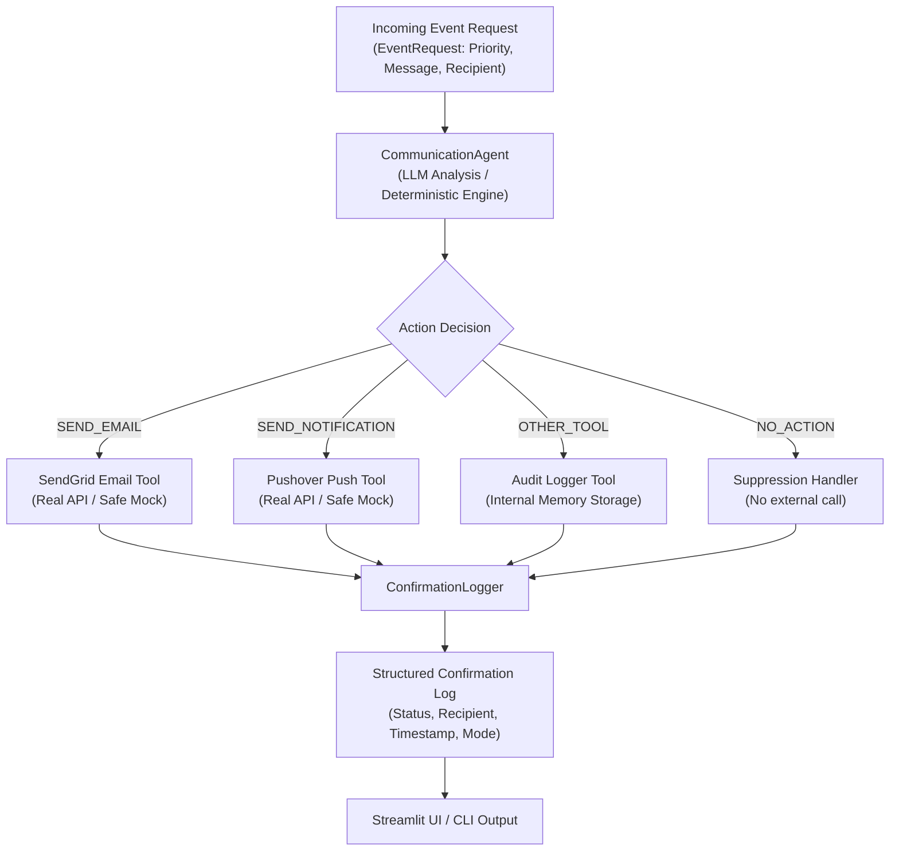
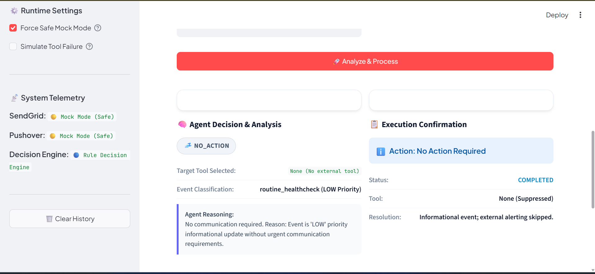
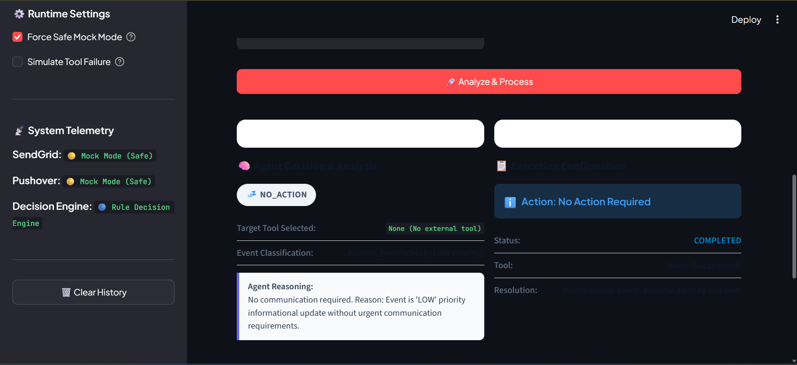
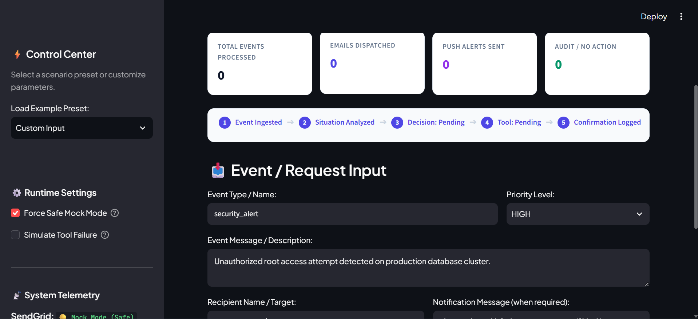
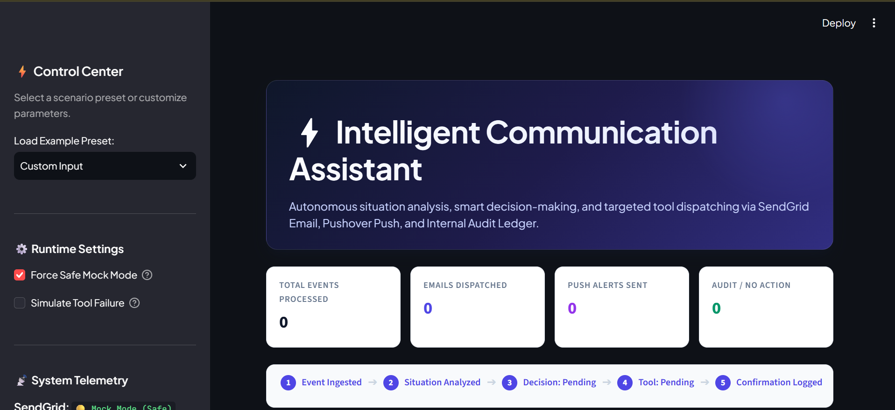

# Project 5: Intelligent Communication Assistant

An autonomous agentic notification and dispatching system designed to evaluate contextual events, determine communication necessity, select the optimal communication channel (SendGrid Email, Pushover Mobile Notification, Internal Audit Logger), and execute dispatches with rigorous confirmation logging.

---

## 📌 Problem Statement

In enterprise incident response, customer operations, and automated monitoring, systems are routinely flooded with events of varying severity and context. Traditional automated alerting suffers from:
1. **Alert Fatigue**: Indiscriminate blasting of notifications across all channels regardless of urgency or relevance.
2. **Brittle Rule Sets**: Static `if/else` triggers that fail to adapt to situational context or natural-language nuance.
3. **Lack of Auditability**: Dispatches occurring without centralized confirmation records, causing compliance and verification blind spots.
4. **Disruptive Failures**: Unhandled downstream API errors that crash parent processes during notification delivery.

---

## 🎯 Project Objective

The **Intelligent Communication Assistant** provides an autonomous, intelligent intermediary layer that:
- Ingests structured and unstructured event requests.
- Leverages intelligent decision reasoning (supporting live LLM engines via Google Gemini / OpenAI with a deterministic fallback) to evaluate event priority and context.
- Exclusively routes actions to the single appropriate delivery channel (`SEND_EMAIL`, `SEND_NOTIFICATION`, `OTHER_TOOL`, or `NO_ACTION`).
- Enforces strict validation on recipient addresses, message payloads, and tokens.
- Logs structured, tamper-evident confirmation records in real time.
- Guarantees fail-safe execution through safe mock modes and graceful error recovery.

---

## ✨ Key Features

- **Context-Aware Decision Engine**: Decides whether communication is necessary and selects the optimal delivery channel without manual routing rules.
- **Dual-Mode LLM & Deterministic Fallback**: Integrates Google Gemini (`gemini-2.5-flash`) and OpenAI API clients with a zero-dependency deterministic engine to guarantee 100% offline testability.
- **Multi-Channel Tool Dispatch**:
  - **SendGrid Email Tool**: Formats and sends emails via SendGrid v3 API or safe simulated mock.
  - **Pushover Notification Tool**: Sends prioritized push alerts with custom sound and urgency tokens.
  - **Internal Audit Logger Tool**: Safely records low-priority or sensitive events locally without external network transmission.
- **Strict Single-Tool Dispatch**: Guarantees no accidental broadcast to multiple unselected channels.
- **Structured Confirmation Logging**: Every decision and tool dispatch generates a typed, in-memory `ConfirmationLog` capturing timestamps, latency, execution mode, and status without exposing credentials.
- **Interactive Streamlit UI**: Glassmorphic dashboard for dynamic event triggering, priority selection, live agent evaluation, and real-time confirmation log inspection.
- **CLI Batch Runner**: Headless runner (`run_demo.py`) for automated test runs and CI/CD pipelines.

---

## 🏗️ System Architecture



---

## 🛠️ Technologies Used

| Layer | Technology | Purpose |
| :--- | :--- | :--- |
| **Language** | Python 3.11+ | Core programming runtime |
| **Agent Reasoning** | Google GenAI / OpenAI / Deterministic | Multi-model situation evaluation & decision making |
| **Schema Validation** | Pydantic v2 (`BaseModel`, `Field`) | Strict request and log typing |
| **HTTP Clients** | `requests` | REST API communication with SendGrid & Pushover |
| **User Interface** | Streamlit | Web-based interactive dispatch console |
| **Testing** | Pytest, Streamlit AppTest | Automated unit, integration, and UI testing |
| **Configuration** | `python-dotenv` | Secure environment variable handling |

---

## 📂 Project Structure

```text
Project-5/
├── app.py                     # Streamlit interactive web dashboard
├── run_demo.py                # Command-line scenario demonstration script
├── requirements.txt           # Production dependencies
├── .env.example               # Safe environment variable template
├── .gitignore                 # Cache, secret, and bytecode ignore rules
├── README.md                  # Comprehensive technical documentation
├── src/
│   ├── __init__.py            # Package export interfaces
│   ├── agent.py               # CommunicationAgent decision engine
│   ├── config.py              # Environment and credential management
│   ├── logger.py              # Central confirmation logging system
│   ├── models.py              # Pydantic schemas (EventRequest, ConfirmationLog)
│   └── tools/
│       ├── __init__.py        # Tool package exports
│       ├── audit_logger_tool.py # Internal audit logging tool
│       ├── pushover_tool.py   # Pushover mobile push notification client
│       └── sendgrid_tool.py   # SendGrid email dispatch client
└── tests/
    ├── __init__.py
    ├── test_agent.py          # 8 backend & tool execution tests
    └── test_streamlit_app.py  # 6 Streamlit UI & integration tests
```

---

## 🚀 Installation & Setup

### 1. Prerequisites
- Python 3.11 or higher
- Git

### 2. Clone & Navigate
```bash
git clone https://github.com/Razzaq696/Agentic-Ai.git
cd Agentic-Ai/Project-5
```

### 3. Create & Activate Virtual Environment
```bash
python -m venv .venv

# Windows (Command Prompt / PowerShell)
.venv\Scripts\activate

# Linux / macOS
source .venv/bin/activate
```

### 4. Install Dependencies
```bash
pip install -r requirements.txt
```

---

## ⚙️ Environment Configuration

Copy the example environment configuration file:
```bash
cp .env.example .env
```

Configure the variables inside `.env`:
```ini
# --- SendGrid Configuration ---
SENDGRID_API_KEY=your_sendgrid_api_key_here
SENDGRID_FROM_EMAIL=notifications@yourdomain.com

# --- Pushover Configuration ---
PUSHOVER_API_TOKEN=your_pushover_api_token_here
PUSHOVER_USER_KEY=your_pushover_user_key_here

# --- Optional LLM API Keys (Falls back to deterministic engine if unset) ---
GEMINI_API_KEY=your_gemini_api_key_here
OPENAI_API_KEY=your_openai_api_key_here

# --- Safe Mock Mode ---
# When true (or when keys are empty), all dispatches run in safe simulated mode
DEFAULT_MOCK_MODE=true
```

> [!NOTE]
> If API credentials are not provided or remain as placeholder values, all tools safely default to **Mock Mode**, simulating realistic deliveries without external requests or cost.

---

## 🖥️ How to Run

### Interactive Streamlit Web Interface
Launch the web console:
```bash
streamlit run app.py
```
Open your browser at `http://localhost:8501` to:
- Select from pre-built event scenarios (Critical Server Outage, Security Alert, Routine Summary, Low-Priority Note).
- Create custom events with dynamic recipient, subject, priority, and channel conditions.
- View real-time agent reasoning, chosen dispatch action, execution telemetry, and structured confirmation logs.

### Headless CLI Demonstration
To run the automated scenario runner from the terminal:
```bash
python run_demo.py
```

---

## 💡 Usage Example

### Programmatic Python Invocation

```python
from src.agent import CommunicationAgent
from src.models import EventRequest, ActionType
from src.logger import global_logger

# 1. Initialize the intelligent agent
agent = CommunicationAgent()

# 2. Formulate an incident event
event = EventRequest(
    event_type="database_failover",
    priority="high",
    message="Production DB replica promoted after master node heartbeat timeout.",
    recipient="oncall-lead",
    email="devops-oncall@company.com",
    notification_text="CRITICAL: DB failover triggered on primary cluster.",
    conditions={"urgent": True, "after_hours": True}
)

# 3. Process the event autonomously
decision, result = agent.process_event(event)

print(f"Action Taken: {decision.action.value}")
print(f"Reasoning: {decision.reasoning}")
print(f"Delivery Status: {result.status}")
print(f"Execution Mode: {result.mode}")

# 4. Inspect confirmation logs
logs = global_logger.get_logs()
print(f"Logged Confirmation ID: {logs[-1].id}")
```

---

## 🧪 Testing & Verification

The test suite includes 14 comprehensive tests covering decision reasoning, input validation, tool execution, failure handling, and Streamlit UI behavior.

Run the test suite:
```bash
pytest tests/ -v
```

### Test Coverage Breakdown
- `test_agent.py`:
  - `test_email_decision`: Verifies routing to SendGrid for high-priority email requests.
  - `test_notification_decision`: Verifies routing to Pushover for urgent mobile alerts.
  - `test_no_action`: Confirms intentional suppression when communication is unnecessary.
  - `test_tool_failure_handling`: Validates graceful error recovery when a downstream tool fails.
  - `test_other_tool_decision`: Verifies internal audit logging without external transmission.
  - `test_exclusive_tool_selection`: Ensures only the designated tool is called.
  - `test_sendgrid_validation_error`: Asserts recipient format validation on emails.
  - `test_pushover_validation_error`: Asserts payload validation on push notifications.
- `test_streamlit_app.py`:
  - `test_streamlit_initial_load`: Verifies initial UI component rendering.
  - `test_streamlit_email_flow`: Tests full event submission through SendGrid flow.
  - `test_streamlit_notification_flow`: Tests full event submission through Pushover flow.
  - `test_streamlit_no_action_flow`: Tests event submission resulting in `NO_ACTION`.
  - `test_streamlit_tool_failure_flow`: Verifies UI error banners on tool failure simulation.
  - `test_streamlit_empty_input_validation`: Verifies input validation on empty submissions.

---

## 🛡️ Edge Cases & Error Handling

1. **Malformed Email Addresses**: Missing `@` or invalid top-level domain returns a structured `failed` `ToolResult` with clear validation messaging rather than triggering HTTP exceptions.
2. **Empty Notification Payloads**: Pushover dispatches with empty message strings are rejected at the tool boundary.
3. **API Network Timeouts**: External HTTP failures are caught and packaged into the `ToolResult.error` field, ensuring the agent logs the incident without throwing unhandled exceptions.
4. **Missing or Placeholder API Keys**: Automatically routes dispatches through safe mock execution, printing diagnostic notices while allowing end-to-end testing without credentials.

---

## 📋 Limitations & Roadmap

- **Multi-Recipient Batching**: Currently dispatches to a single primary recipient per event; batch distribution lists will be added in Phase 2.
- **SMS / Webhook Channels**: Future iterations will integrate Twilio SMS and Slack/Discord webhook connectors.
- **Persistent SQLite Audit Storage**: While the in-memory confirmation logger maintains full session fidelity, persistent database storage will enable historical analytics across server restarts.

---

## 📸 Application Screenshots

| Event Creator & Preset Scenarios | Channel Selection & Dispatch Details |
| :---: | :---: |
|  |  |
| *Event Ingestion & Parameters* | *Recipient, Priority & Channel Rules* |

<br/>

| Agent Decision Reasoning | Structured Confirmation Log Table |
| :---: | :---: |
|  |  |
| *Tool Execution Result & Reasoning* | *Central Audit Log & Latency Telemetry* |

---

## 📜 Author & License

- **Author**: AbdulRazzaq Sanwal ([@Razzaq696](https://github.com/Razzaq696))
- **Repository**: [https://github.com/Razzaq696/Agentic-Ai](https://github.com/Razzaq696/Agentic-Ai)
- **License**: MIT License

