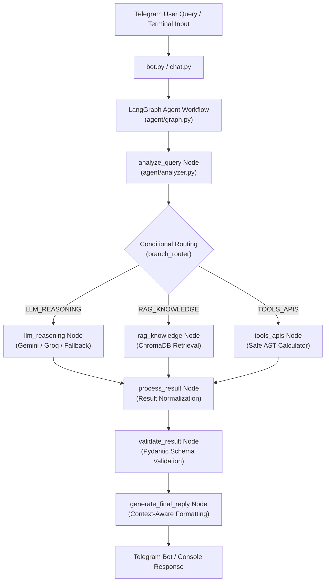
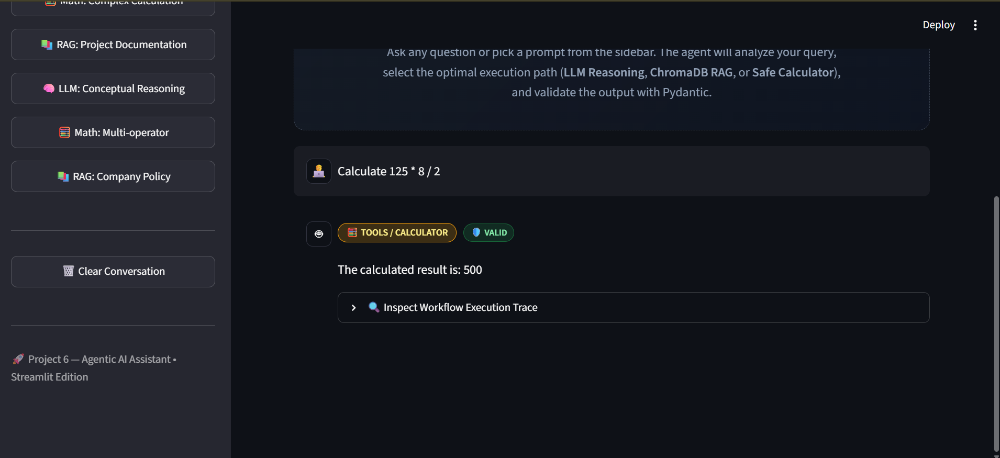
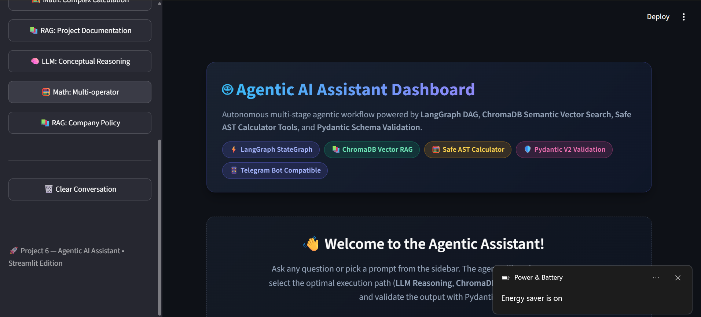
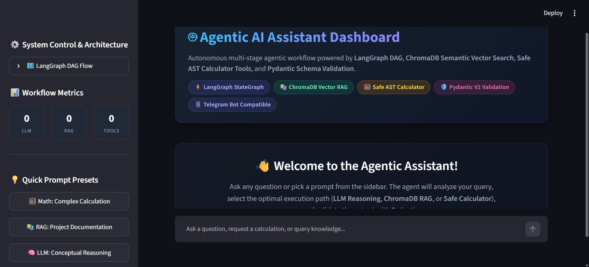
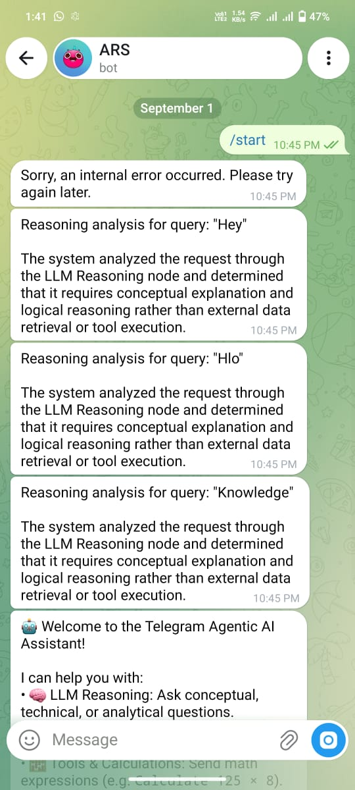

# Project 6: Telegram Agentic AI Assistant

A production-grade, conversational Agentic AI system deployed on **Telegram** and powered by a stateful **LangGraph Agent Workflow**. The assistant dynamically classifies user queries, routes them across specialized branches (LLM Reasoning, ChromaDB RAG Knowledge Retrieval, AST Arithmetic Tools), standardizes execution results, enforces Pydantic data validation, and delivers natural responses with zero secret leakage.

---

## 📌 Problem Statement

Traditional conversational bots on messaging platforms such as Telegram are typically either simple rule-based keyword matchers or unconstrained LLM wrappers:
1. **Unstructured Reasoning**: Raw LLMs struggle with deterministic math, frequently hallucinating arithmetic computations.
2. **Context Blindness**: Without grounding in private organizational or domain documents, bots cannot accurately answer specific policy or project questions.
3. **Fragile Exception Handling**: Network timeouts, parsing exceptions, and API downtime often crash bots or expose raw tracebacks and environment keys to end users.
4. **Lack of Controlled Routing**: Monolithic prompts try to handle everything simultaneously rather than modularly delegating to dedicated tools or knowledge bases.

---

## 🎯 Project Objective

The **Telegram Agentic AI Assistant** provides an autonomous, multi-stage agent architecture that:
- Seamlessly integrates with the Telegram Bot API (`python-telegram-bot`) for live user interaction.
- Utilizes **LangGraph** to construct a deterministic, multi-branch directed acyclic graph (DAG).
- Dynamically classifies user intent into three core execution pipelines:
  1. **LLM Reasoning**: Natural language understanding, creative synthesis, and conceptual explanations via Gemini / Groq.
  2. **RAG Knowledge**: Vector similarity retrieval over curated domain documentation stored in ChromaDB.
  3. **Tools / APIs**: High-precision, sandboxed AST-based mathematical calculations.
- Normalizes and validates all branch results via **Pydantic** models before final response generation.
- Traps all internal errors gracefully, returning clean, user-friendly error messages without exposing internals.

---

## ✨ Key Features

- **Autonomous Intent Classification (`analyzer.py`)**: Evaluates free-form queries and selects the optimal path (`LLM_REASONING`, `RAG_KNOWLEDGE`, or `TOOLS_APIS`).
- **LangGraph StateGraph Workflow (`graph.py`)**: Cyclic and conditional state machine with discrete nodes: `analyze_query` ➔ `branch_router` ➔ `process_result` ➔ `validate_result` ➔ `generate_final_reply`.
- **RAG Knowledge Subsystem (`rag.py`)**: Vector retrieval with persistent ChromaDB indexing curated domain documents (`data/knowledge_docs.json`).
- **Safe AST Calculator (`tools.py`)**: Evaluates complex mathematical expressions without dangerous `eval()` calls, handling operators (`+`, `-`, `*`, `/`, `^`, `%`) and trapping division-by-zero errors.
- **Pydantic Result Validation (`validation.py`)**: Guarantees structural integrity, response non-emptiness, and confidence validation before dispatching replies.
- **Dual Interface Access**:
  - **Live Telegram Bot (`bot.py`)**: Asynchronous polling bot handling `/start`, `/help`, and continuous messaging.
  - **Interactive Terminal Chat (`chat.py`)**: Direct console conversation interface for local debugging and rapid interaction.
  - **CLI Batch Demo (`main.py`)**: Deterministic demonstration script tracing all execution routes.

---

## 🏗️ System Architecture



---

## 🛠️ Technologies Used

| Layer | Technology | Purpose |
| :--- | :--- | :--- |
| **Language** | Python 3.11+ | Core programming runtime |
| **Agent Orchestration** | LangGraph (`StateGraph`, `END`) | State machine, conditional routing, and node management |
| **Vector Database** | ChromaDB | Local vector store and semantic similarity retrieval |
| **Bot Interface** | `python-telegram-bot` (v21+) | Asynchronous Telegram Bot API wrapper |
| **Data Validation** | Pydantic v2 | State schemas and result validation |
| **LLM Providers** | Google GenAI (`gemini-2.5-flash`), Groq (`llama-3.3-70b`) | Generative language and contextual reasoning |
| **Testing** | Pytest, Pytest-Asyncio | Automated unit, integration, failure, and bot testing |
| **Configuration** | `python-dotenv` | Secure API key and credential management |

---

## 📂 Project Structure

```text
Project-6/
├── bot.py                     # Telegram Bot entry point (async polling)
├── chat.py                    # Interactive terminal chat console
├── main.py                    # CLI workflow demonstration runner
├── requirements.txt           # Production dependencies
├── .env.example               # Safe environment variable template
├── .gitignore                 # Secrets, cache, and bytecode ignore rules
├── README.md                  # Comprehensive technical documentation
├── data/
│   └── knowledge_docs.json    # Curated knowledge documents for ChromaDB RAG
├── agent/
│   ├── __init__.py            # Package exports
│   ├── analyzer.py            # Intent classification and route selection
│   ├── graph.py               # LangGraph StateGraph construction and compilation
│   ├── llm.py                 # LLM client setup and fallback reasoning
│   ├── nodes.py               # Node execution functions for each workflow step
│   ├── rag.py                 # ChromaDB indexing and vector retrieval
│   ├── runner.py              # Entry-point wrapper function run_agent()
│   ├── state.py               # AgentState TypedDict definition
│   ├── tools.py               # Safe AST Math Evaluator and DateTime tools
│   └── validation.py          # Pydantic schemas and output validation
└── tests/
    ├── __init__.py
    ├── test_agent.py          # Core routing and LangGraph compilation tests
    ├── test_failures.py       # Failure injection, edge cases, and validation tests
    └── test_telegram_integration.py # Telegram bot end-to-end integration tests
```

---

## 🚀 Installation & Setup

### 1. Prerequisites
- Python 3.11 or higher
- Telegram account and Bot Token (from [@BotFather](https://t.me/BotFather))
- Optional: Google Gemini API Key or Groq API Key

### 2. Clone & Navigate
```bash
git clone https://github.com/Razzaq696/Agentic-Ai.git
cd Agentic-Ai/Project-6
```

### 3. Create & Activate Virtual Environment
```bash
python -m venv .venv

# Windows (Command Prompt / PowerShell)
.venv\Scripts\activate

# Linux / macOS
source .venv/bin/activate
```

### 4. Install Dependencies
```bash
pip install -r requirements.txt
```

---

## ⚙️ Environment Configuration

Copy the example configuration file:
```bash
cp .env.example .env
```

Configure `.env` with your credentials:
```ini
# Telegram Bot Configuration (Obtain from @BotFather on Telegram)
TELEGRAM_BOT_TOKEN=your_telegram_bot_token_here

# LLM API Keys (Optional - default fallback reasoning is active)
GEMINI_API_KEY=your_gemini_api_key_here
GOOGLE_API_KEY=your_google_api_key_here
GROQ_API_KEY=your_groq_api_key_here

# Model Selection
DEFAULT_LLM_PROVIDER=gemini
GEMINI_MODEL=gemini-2.5-flash
GROQ_MODEL=llama-3.3-70b-versatile
```

> [!NOTE]
> If LLM API keys are omitted, the assistant seamlessly switches to its built-in rule and heuristic reasoning engine, guaranteeing complete test and workflow functionality without external API dependencies.

---

## 🖥️ How to Run

### 1. Launch the Live Telegram Bot
```bash
python bot.py
```
Open Telegram, search for your bot username, and send:
- `/start` — Initializes the bot and displays capabilities.
- `/help` — Lists supported commands and example prompts.
- Any message:
  - Math: `"Calculate 25 * 40 + 150 / 3"`
  - Policy: `"What is the attendance policy?"`
  - Concept: `"Explain how agentic workflows differ from standard chains."`

### 2. Interactive Terminal Chat
To converse directly in the terminal without Telegram:
```bash
python chat.py
```

### 3. Automated CLI Demonstration
To trace all routing paths and validation outputs in the console:
```bash
python main.py
```

---

## 💡 Usage Examples

### 1. Mathematical Tool Route
- **User Query**: `"What is (125 * 8) / 4 + 50?"`
- **Agent Route**: `TOOLS_APIS` (Safe AST Calculator)
- **Bot Response**:
  ```text
  Result: 300.0
  Calculation: (125 * 8) / 4 + 50 = 300.0
  ```

### 2. Knowledge RAG Route
- **User Query**: `"What is the policy on grading and GPA requirements?"`
- **Agent Route**: `RAG_KNOWLEDGE` (ChromaDB Semantic Retrieval)
- **Bot Response**:
  ```text
  According to university academic policy, students must maintain a cumulative GPA of 3.0 or higher for merit scholarship retention...
  ```

### 3. LLM Conceptual Reasoning Route
- **User Query**: `"Why is LangGraph preferred for cyclic agent architectures?"`
- **Agent Route**: `LLM_REASONING` (Gemini / Groq / Reasoning Engine)
- **Bot Response**:
  ```text
  LangGraph introduces explicit state machines with cyclic graph support, allowing multi-step reflection, self-correction, and tool-feedback loops that traditional DAGs cannot natively represent...
  ```

---

## 🧪 Testing & Verification

Project 6 includes 23 automated pytest tests spanning graph compilation, routing correctness, tool error trapping, RAG validation, and Telegram integration.

Run the test suite:
```bash
python -m pytest tests/ -v
```

### Test Coverage Summary
- **`test_agent.py` (10 tests)**:
  - Verifies graph compilation and node existence.
  - Tests core routing decisions across LLM, RAG, and Tool branches.
  - Validates AST division-by-zero trapping and invalid math handling.
  - Validates empty and whitespace query rejection.
- **`test_failures.py` (4 tests)**:
  - Injects empty and corrupted result states to confirm Pydantic validation catches anomalies.
  - Verifies RAG empty context fallback and graceful exception recovery.
- **`test_telegram_integration.py` (9 tests)**:
  - Tests `/start` and `/help` command handlers.
  - End-to-end integration tests for LLM, RAG, and Tool messages via Telegram mock harness.
  - Confirms friendly user-facing messages when errors or unexpected exceptions occur.

---

## 🛡️ Edge Cases & Error Handling

1. **Division by Zero**: AST evaluator detects zero denominators and returns a structured error: `"Cannot divide by zero"` rather than raising `ZeroDivisionError`.
2. **Invalid Arithmetic Expressions**: Non-math characters or malformed syntax produce user-friendly calculation errors.
3. **Empty or Whitespace Queries**: Filtered immediately with prompt guidance before entering the LangGraph workflow.
4. **ChromaDB Missing Context**: If no relevant documents exceed similarity thresholds, the system provides a clear out-of-scope response without fabricating citations.
5. **Telegram Bot Disconnections**: Managed via asynchronous polling handlers that retry on network interruption.

---

## 📋 Limitations & Roadmap

- **Voice Notes & Audio**: Currently processes text messages; future milestones include Whisper integration for voice-to-text queries.
- **Image & Document Attachments**: Support for uploading PDFs and images directly to Telegram for inline RAG processing.
- **User Session Memory**: Persistent multi-turn conversation memory stored in Redis or SQLite checkpointers.

---

## 📸 Application Screenshots

| Streamlit Agent GUI | Route Tracing & Tool Calculation |
| :---: | :---: |
|  |  |
| *Streamlit Interactive Agent Interface* | *Dynamic Route: TOOL_API & Result* |

<br/>

| RAG Retrieval & Normalized Output | Live Telegram Bot Integration |
| :---: | :---: |
|  |  |
| *Knowledge Retrieval & Pydantic Validation* | *Live Telegram Bot Conversation & Commands* |

---

## 📜 Author & License

- **Author**: AbdulRazzaq Sanwal ([@Razzaq696](https://github.com/Razzaq696))
- **Repository**: [https://github.com/Razzaq696/Agentic-Ai](https://github.com/Razzaq696/Agentic-Ai)
- **License**: MIT License

